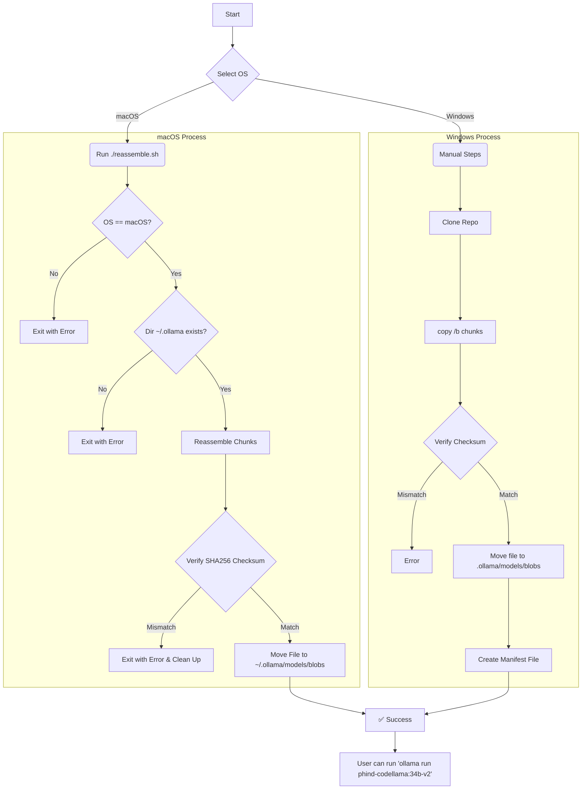

# Phind CodeLlama 34B v2 - Offline Model Installer

## ⚠️ Important Disclaimer

This repository and the tools within are provided as a workaround for users who are unable to download Ollama models directly due to restrictive corporate network policies. 

**You are solely responsible for ensuring that using this model and the methods in this repository complies with your organization's IT, data security, and fair use policies.** 

If you have any reason to believe that downloading, storing, or using this model on your corporate-managed device is against policy, **DO NOT PROCEED**. By using the contents of this repository, you acknowledge that you are doing so at your own risk and are responsible for any potential policy violations.

---

## About This Repository

This repository offers a method to install the `phind-codellama-34b-v2` Ollama model for users on corporate networks where direct downloads from `ollama.ai` are blocked. Many corporate firewalls and proxies restrict access to domains like `cloudflarestorage.com`, which prevents the Ollama client from downloading new models.

This project circumvents this issue by providing the model in a series of smaller, 50MB chunks. A shell script is included to reassemble these chunks, verify the integrity of the final file, and move it to the correct local Ollama directory.

### Target Audience

This is intended for developers and engineers on **macOS or Windows** laptops who are blocked from downloading Ollama models directly. This model requires at least **24GB of RAM** to run effectively.

## Prerequisites

- A **macOS or Windows** computer.
- A minimum of **24GB of RAM** to run the model effectively.
- **Ollama** installed and run at least once to create the necessary directories.
- At least **40GB** of free disk space for the installation process.
- **For macOS:** Zsh (default shell on modern macOS).
- **For Windows:** Command Prompt or PowerShell.

## Installation

### For macOS Users

#### Recommended Method: One-Line Command

This is the easiest way to get started. Open your terminal and run the following command. It will automatically download the necessary files, check for disk space, run the reassembly script, and clean up after itself.

```sh
curl -sSL https://raw.githubusercontent.com/enelass/phind-codellama-34b-v2/main/install.sh | zsh
```

The installer script performs the following actions:
- Checks for at least 40GB of free space in `/tmp`.
- Downloads the repository archive to `/tmp`.
- Extracts the contents.
- Runs the `reassemble.sh` script to build and install the model.
- Deletes the temporary files.

#### Manual Installation (macOS)

If you prefer to perform the steps manually, follow the instructions below.

1.  **Clone the Repository**
    ```sh
    git clone https://github.com/enelass/phind-codellama-34b-v2.git
    cd phind-codellama-34b-v2
    ```

2.  **Make the Script Executable**
    ```sh
    chmod +x reassemble.sh
    ```

3.  **Run the Reassembly Script**
    ```sh
    ./reassemble.sh
    ```

### For Windows Users

Windows users need to perform the installation manually using Command Prompt or PowerShell.

1.  **Clone the Repository**
    ```sh
    git clone https://github.com/enelass/phind-codellama-34b-v2.git
    cd phind-codellama-34b-v2
    ```

2.  **Reassemble the Model**
    Navigate into the `model-chunks` directory and use the `copy` command to combine the parts. The final file will be named based on its SHA256 hash.
    ```cmd
    cd model-chunks
    copy /b part_* ..\sha256-45488384ce7a0a42ed3afa01b759df504b9d994f896aacbea64e5b1414d38ba2
    cd ..
    ```

3.  **Verify the Checksum**
    After reassembly, verify the file's integrity. The expected SHA256 hash is listed in the `model-chunks` directory.
    ```cmd
    certutil -hashfile sha256-45488384ce7a0a42ed3afa01b759df504b9d994f896aacbea64e5b1414d38ba2 SHA256
    ```
    The first line of the output from the `certutil` command must be `45488384ce7a0a42ed3afa01b759df504b9d994f896aacbea64e5b1414d38ba2`. If it does not match, the file is corrupt.

4.  **Install the Model**
    Move the reassembled model file to your local Ollama blobs directory. The `.ollama` directory is typically in your user profile folder (`C:\Users\<YourUsername>\.ollama`).
    ```cmd
    mkdir "%USERPROFILE%\.ollama\models\blobs" 2>NUL
    move sha256-45488384ce7a0a42ed3afa01b759df504b9d994f896aacbea64e5b1414d38ba2 "%USERPROFILE%\.ollama\models\blobs"
    ```

5. **Create the Manifest File**
   You need to create a manifest file so Ollama recognizes the model. 
   First, ensure the manifest directories exist:
   ```cmd
   mkdir "%USERPROFILE%\.ollama\models\manifests\registry.ollama.ai\library\phind-codellama" 2>NUL
   ```
   Next, create a file named `34b-v2` (no extension) inside that directory with the following JSON content. You can use a text editor or the `echo` command.
   
   ```json
   {
      "schemaVersion": 2,
      "mediaType": "application/vnd.docker.distribution.manifest.v2+json",
      "config": {
         "mediaType": "application/vnd.docker.container.image.v1+json",
         "digest": "sha256:e3dd5890064945c7454a0a79732a549334d4263644996205251b644555451698",
         "size": 489
      },
      "layers": [
         {
            "mediaType": "application/vnd.ollama.image.model",
            "digest": "sha256:45488384ce7a0a42ed3afa01b759df504b9d994f896aacbea64e5b1414d38ba2",
            "size": 19077991712
         },
         {
            "mediaType": "application/vnd.ollama.image.license",
            "digest": "sha256:e6f338428844f367624a89f481e38975a236157d352cd4833c5400f53159254b",
            "size": 8433
         },
         {
            "mediaType": "application/vnd.ollama.image.modelfile",
            "digest": "sha256:3f658704402f369143e2033ea99c5722cf35e8b62a4b3c88e1eac7941a675ad2",
            "size": 556
         },
         {
            "mediaType": "application/vnd.ollama.image.template",
            "digest": "sha256:6f757d343e67554576837b34b8a347a2d20236424251428834c795d8a1b40ebb",
            "size": 136
         }
      ]
   }
   ```

## Run the Model

Once the installation is complete, you can use the model with Ollama:
```sh
ollama run phind-codellama:34b-v2
```

## How It Works

The core logic for macOS is contained in the `reassemble.sh` script. For Windows, the process is manual.


