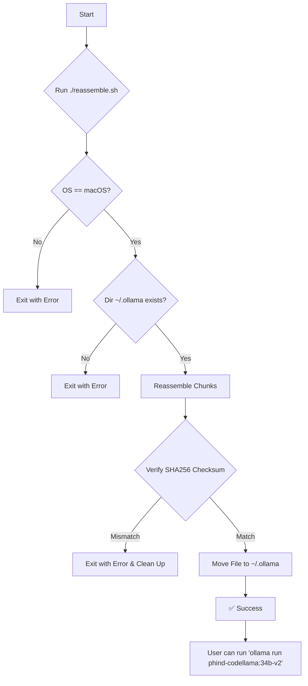

# Phind CodeLlama 34B v2 - Offline Model Installer

## ⚠️ Important Disclaimer

This repository and the tools within are provided as a workaround for users who are unable to download Ollama models directly due to restrictive corporate network policies. 

**You are solely responsible for ensuring that using this model and the methods in this repository complies with your organization's IT, data security, and fair use policies.** 

If you have any reason to believe that downloading, storing, or using this model on your corporate-managed device is against policy, **DO NOT PROCEED**. By using the contents of this repository, you acknowledge that you are doing so at your own risk and are responsible for any potential policy violations.

---

## About This Repository

This repository offers a method to install the `phind-codellama-34b-v2` Ollama model for users on corporate networks where direct downloads from `ollama.ai` are blocked. Many corporate firewalls and proxies restrict access to domains like `cloudflarestorage.com`, which prevents the Ollama client from downloading new models.

This project circumvents this issue by providing the model in a series of smaller, 50MB chunks. A shell script is included to reassemble these chunks, verify the integrity of the final file, and move it to the correct local Ollama directory.

### Target Audience

This is intended for developers and engineers on macOS laptops with at least **24GB of RAM** who are blocked from downloading Ollama models directly.

## Installation

### Recommended Method: One-Line Command

This is the easiest way to get started. Open your terminal and run the following command. It will automatically download the necessary files, check for disk space, run the reassembly script, and clean up after itself.

**Important**: You must replace `<YOUR_GITHUB_USERNAME>` with the GitHub username where this repository is hosted.

```sh
curl -sSL https://raw.githubusercontent.com/enelass/phind-codellama-34b-v2/main/install.sh | zsh
```

The installer script performs the following actions:
- Checks for at least 40GB of free space in `/tmp`.
- Downloads the repository archive to `/tmp`.
- Extracts the contents.
- Runs the `reassemble.sh` script to build and install the model.
- Deletes the temporary files.

### Manual Installation

If you prefer to perform the steps manually, follow the instructions below.

1.  **Clone the Repository**
    ```sh
    git clone https://github.com/<YOUR_GITHUB_USERNAME>/phind-codellama-34b-v2.git
    cd phind-codellama-34b-v2
    ```

2.  **Make the Script Executable**
    ```sh
    chmod +x reassemble.sh
    ```

3.  **Run the Reassembly Script**
    ```sh
    ./reassemble.sh
    ```

4.  **Run the Model**
    Once the script completes successfully, you can use the model with Ollama:
    ```sh
    ollama run phind-codellama:34b-v2
    ```

## How It Works

The core logic is contained in the `reassemble.sh` script, which is executed by either the one-line installer or your manual command. The process is as follows:



## Prerequisites

- A **macOS** computer.
- A minimum of **24GB of RAM** to run the model effectively.
- **Zsh** installed (default shell on modern macOS).
- **Ollama** installed and run at least once to create the necessary directories.
- At least **40GB** of free space in your `/tmp` directory for the installation process.
